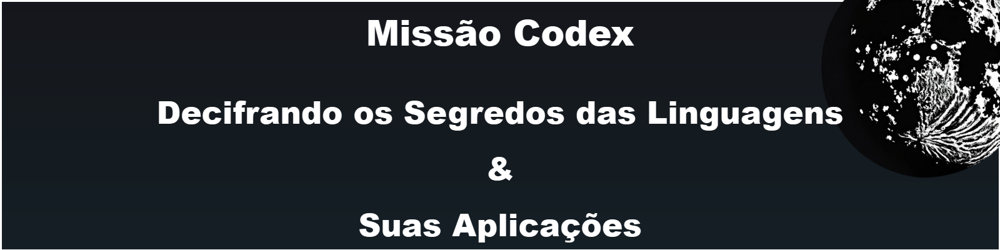

  

  <a href="#intro">Apresentação do projeto</a>&nbsp;&nbsp;&nbsp;|&nbsp;&nbsp;&nbsp;
  <a href="#goal">Objetivo</a>&nbsp;&nbsp;&nbsp;|&nbsp;&nbsp;&nbsp;
  <a href="#techs">Tecnologias</a>&nbsp;&nbsp;&nbsp;|&nbsp;&nbsp;&nbsp;
  <a href="#prompts">Prompts</a>&nbsp;&nbsp;&nbsp;|&nbsp;&nbsp;&nbsp;
  <a href="#process">Processo de criação</a>&nbsp;&nbsp;&nbsp;|&nbsp;&nbsp;&nbsp;
  <a href="#first-episode">Episódio 01</a>&nbsp;&nbsp;&nbsp;|&nbsp;&nbsp;&nbsp;
  <a href="#author">Sobre mim</a>

---

<!-- styles not supported 
<h1 aLign="center">
Missão Codex</h1><h2>Decifrando os Segredos das Linguagens e suas Aplicações</h2>
 -->

<h2 id="intro">Apresentação do projeto</h2>

<video width="100%" controls>
  <source src="./assets/Video/intro_video.mp4" type="video/mp4">
</video>

<h2 id="goal">Objetivo 📌</h2>

O objetivo desse projeto é, utilizando inteligência artificial, produzir um podcast que tenha fator visual, seja estruturado com roteiro e tenha um assunto pré-definido.

A utilidade das inteligências artificiais está em agregar valor no resultado final, produzindo um conteúdo enriquecido com conhecimentos disponíveis em toda a internet, que seja estruturado de maneira profissional, sendo o conhecimento humano válido para avaliar o conteúdo gerado e incrementar informações extra, além da possibilidade de se ter uma imagem rica em detalhes e de qualidade.

O projeto exige da parte humana conhecimento prévio no assunto tratado e, ao menos, noções em Engenharia de Prompt, úteis no comando de roteiro, produção de imagens e geração de áudio através de texto. É um diferencial saber utilizar ferramentas de edição de áudio, imagem e vídeo.

Minha proposta é um podcast que faz alusão à exploração e missões espaciais tendo como tema principal as linguagens de programação, as principais aplicações de cada uma delas e o mercado de cada uma. O objetivo é mostrar ao público o conjunto de linguagens disponíveis e o que fazer com elas.
O público-alvo são pessoas interessadas em aprender mais sobre o mundo da programação, a variedade de linguagens e sua utilidade.

<h2 id="techs">Tecnologias 💻</h2>

- Vídeo de apresentação gerado com <a href="https://app.heygen.com/">HeyGen</a>
- Roteiro gerado com <a href="https://chat.openai.com/">ChatGPT</a>
- Imagem capturada em acervo público do <a href="https://lexica.art/">Lexica</a>
- Áudio gerado com <a href="https://beta.elevenlabs.io/">ElevenLabs</a>
- Áudio editado com <a href="https://www.capcut.com/pt-br/">CapCut</a>

<h2 id="prompts">Prompts 📜</h2>

**ChatGPT:**

| Ação             | Prompt                                                                                                                                                                                                                                                                                                                                                                                                                                                                                                                                                                                                                                                                                                                                                                                                                                                                                                                                                                                                                                                                                                                                                                                                                                                                                                                                                                                   |
| ---------------- | ---------------------------------------------------------------------------------------------------------------------------------------------------------------------------------------------------------------------------------------------------------------------------------------------------------------------------------------------------------------------------------------------------------------------------------------------------------------------------------------------------------------------------------------------------------------------------------------------------------------------------------------------------------------------------------------------------------------------------------------------------------------------------------------------------------------------------------------------------------------------------------------------------------------------------------------------------------------------------------------------------------------------------------------------------------------------------------------------------------------------------------------------------------------------------------------------------------------------------------------------------------------------------------------------------------------------------------------------------------------------------------------- |
| Contextualização | Assuma o papel de um roteirista de podcast e juntos vamos criar um podcast sobre linguagens de programação, as principais aplicações de cada uma delas e o mercado de cada uma. O intuito é mostrar ao público o acervo de linguagens disponíveis e o que fazer com elas.                                                                                                                                                                                                                                                                                                                                                                                                                                                                                                                                                                                                                                                                                                                                                                                                                                                                                                                                                                                                                                                                                                                |
| Nome             | Crie 5 sugestões de nomes para o podcast, que contenham trocadilhos e sejam interessantes. {REGRAS}: O nome deve ser enxuto e possuir um subtítulo; O nome tenha algum trocadilho relacionado com exploração espacial e missões espaciais; {REGRAS NEGATIVAS}: Não quero que o título contenha termos técnicos; O subtítulo não deve ser grande, construa para que narre de forma concisa o podcast                                                                                                                                                                                                                                                                                                                                                                                                                                                                                                                                                                                                                                                                                                                                                                                                                                                                                                                                                                                      |
| Roteiro          | Você é o roteirista do podcast "Missão Codex: Decifrando os Segredos das Linguagens e suas Aplicações" com foco em linguagens de programação, principais aplicações e momento de mercado. O público alvo são pessoas interessadas em conhecer mais sobre o universo de programação, a gama de linguagens e a utilidade delas.  A estrutura do roteiro deve ser: [INTRODUÇÃO]; [APLICAÇÕES]; [MERCADO]; [FINALIZAÇÃO];  {REGRAS}: - no bloco [INTRODUÇÃO] vamos apresentar a linguagem do episódio de hoje, construindo uma narrativa informal, interessante e cativante; - no bloco [APLICAÇÕES] substitua por exemplos de sistemas famosos que sejam ou foram desenvolvidos pela linguagem do episódio e crie um exemplo breve de algum sistema que poderia ser criado utilizando essa linguagem; - no bloco [MERCADO] traga os motivos pelo quais seria válido aprender essa linguagem e áreas de atuação; - no bloco [FINALIZAÇÃO] substitua por uma despedida cool que faça uma conclusão e inclua o final 'Meu nome é Heber Gaipo e essa foi a Missão Codex de hoje!'; - use termos de fácil explicação; - O podcast vai ser apresentado somente por uma pessoa, chamada Heber; - O podcast deve ser curto;  {REGRAS NEGATIVAS}: - Não use termos técnicos e de difícil compreensão; - Não ultrapasse 5 minutos de leitura |
| Resumo           | Faça um resumo, com até 1 minuto de duração, que explique o conceito do podcast que estamos criando, baseado nas informações que eu te passei quanto ao foco do podcast e o objetivo e público alvo do podcast.                                                                                                                                                                                                                                                                                                                                                                                                                                                                                                                                                                                                                                                                                                                                                                                                                                                                                                                                                                                                                                                                                                                                                                          |

**Lexica:**

Acervo público de imagens geradas artificialmente relacionadas com a temática de astronauta em uma missão espacial.

<h2 id="process">🧐 Processo de criação</h2>

Para desenvolver o vídeo de introdução utilizei o prompt de ação "Resumo" no ChatGPT para gerar o texto que eu queria que fosse interpretado pelo avatar da plataforma HeyGen. Dentro da plataforma selecionei um template genérico de vídeo para editar, alterei o avatar para o utilizado no vídeo, inseri o texto, selecionando o modelo de voz em portugês e gerei a transcrição. Apliquei a transcrição na linha do tempo do editor, complementando com o áudio de background e deixei todos os componentes com o mesmo prazo de duração. Finalizei o projeto, baixei o vídeo e inseri ele nesse documento.

O desenvolvimento do roteiro se deu seguindo as ações de prompt do ChatGPT.

Para gerar o áudio do podcast no ElevenLabs apliquei o output do ChatGPT no prompt, configurei a voz que mais me interessou e que gerasse o efeito que eu estava buscando e gerei a transcrição.

O resultado final se deu editando o áudio no editor online do CapCut, aplicando o áudio na linha do tempo, selecionei áudios do acervo público para compôr o background, como a música tocada durante todo o conteúdo, efeitos sonoros de foguete, sino tocando e porta se abrindo.

<h2 id="first-episode">🎤 Episódio 01 - Python</h2>

  <!-- <audio src="./assets/Audio/EP01-Python.mp3" controls title="EP01-Python"></audio> -->
  <!-- tag audio not supported -->
  <a href="https://drive.google.com/file/d/1GZwGSJOxvi0abvAS9zLV5HGTUMlFb_Ep/view?usp=drive_link">🎧 Clique para acessar o primeiro episódio</a>

<h2 id="author">Sobre mim</h2>

Sou Héber Stavrakas Gaipo, estudante de engenharia da computação na Universidade do Estado de Minas Gerais e tenho muito interesse nesta área e em tudo que pode ser feito com os conhecimentos adquiridos nesta jornada.

Estou participando do Santander Bootcamp 2024 - Fundamentos de IA para Devs, uma parceria Santander Open Academy com Digital Innovation One.

<h3 aLign="center">Links úteis</h3>

  
  
  

